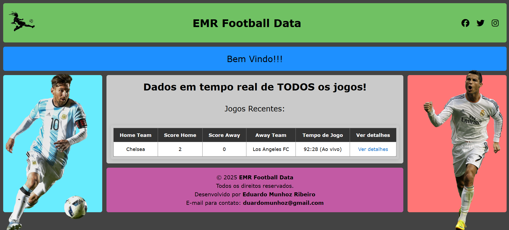
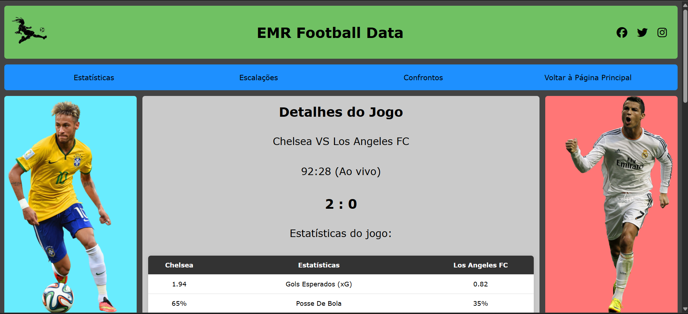

Sistema de Coleta e Disponibilização de Dados Esportivos na web

Este projeto é uma ferramenta de coleta automática de dados esportivos, desenvolvido utilizando a linguagem Python. Ele extrai de forma totalmente automatizada, informações detalhadas como:

    • Estatísticas dos jogos em tempo real;
    • Escalação dos times;
    • Jogadores lesionados;
    • Histórico de confrontos entre as equipes;
    • Entre outros dados relevantes.

Os dados coletados são salvos em um banco de dados, podendo ser utilizados para diversos fins, como:
    
    • Análises estatísticas,
    • Criação de modelos preditivos,
    • Geração de insights,
    • Integração com sistemas externos, como bots de trading esportivo, dashboards ou aplicativos.

O sistema foi desenvolvido com foco em performance e automação, utilizando:
    
    • Paralelismo e multiprocessamento, garantindo eficiência na coleta simultânea de vários jogos;
    • Tratamento inteligente para lidar com:
        ◦ Páginas que demoram a carregar;
        ◦ Dados ausentes;
        ◦ Eventuais bloqueios de acesso.

Para disponibilizar os dados de forma acessível e dinâmica, foi desenvolvido um site que exibe as informações dos jogos em tempo real ultilizando o Framework – Flask. A aplicação é hospedada em uma plataforma, e todo o processo de atualização é automatizado:
    
    • Uma função monitora o fluxo de deploy, interagindo diretamente com a API da plataforma para disparar novos deploys sempre que a condição for cumprida.
    • Outra realiza os comandos do git de forma automática, fenviando esses dados ao GitHub, que serve como fonte para os deploys na plataforma.

O objetivo é garantir que os dados estejam sempre atualizados no site, sem necessidade de intervenção manual, mantendo um fluxo contínuo e eficiente entre coleta, processamento e disponibilização na web.

## 🖼️ Screenshots

### Página Inicial

### Estatísticas da Partida

